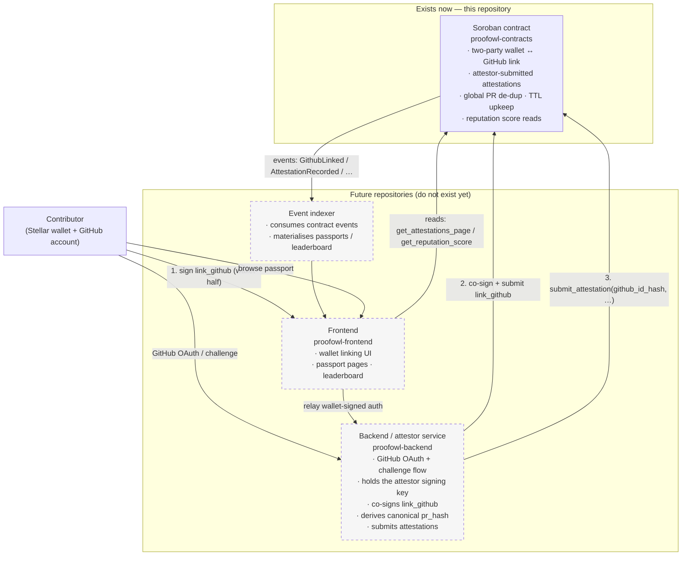

# System architecture

ProofOwl is planned as four parts. **Only the on-chain contract in this
repository exists today.** Everything else below is a future repository
and is drawn dashed.

## Component responsibilities

### Soroban contract — `proofowl-contracts` (this repo, exists)

The on-chain source of truth. It stores wallet ↔ GitHub links and
attestations, enforces that both the wallet and the trusted attestor
authorize a link, resolves the credited wallet from the GitHub identity
hash (never from a caller-supplied address), keeps a permanent global
PR-dedup set, maintains storage TTLs, and answers reputation queries.
It has **no network access** and cannot verify GitHub itself. See
`README.md` and `SECURITY.md`.

### Backend / attestor — `proofowl-backend` (planned)

Runs the off-chain GitHub OAuth / challenge flow that actually proves a
person controls a GitHub account, holds the attestor signing key, and is
the only party that co-signs `link_github` and calls
`submit_attestation`. It must derive `pr_hash` canonically
(`SHA-256(lowercase("github.com/<owner>/<repo>/pull/<number>"))`). The
contract's security model assumes this service behaves correctly; that
assumption is documented, not hidden (`docs/adr/0001`, `docs/adr/0002`).

### Event indexer (planned)

Read-only. Follows contract events to build query-friendly views
(passports, leaderboard) without every frontend hitting the chain
directly. Holds no keys.

### Frontend — `proofowl-frontend` (planned)

The wallet-linking UI and the public passport / leaderboard pages. It
collects the contributor's wallet signature for `link_github`, hands it
to the backend to co-sign, and reads passport data from the indexer or
directly from the contract's read methods.

## Trust boundary in one line

The chain trusts the **attestor key** for *what happened*; it never lets
the attestor choose *whose* wallet gets credit. GitHub ownership is
established off-chain by the backend and vouched for on-chain by the
attestor co-signature. Full detail: `SECURITY.md`.

## Integration contract (what the future repos build against)

The contract's source is at v0.2 (paginated attestation storage,
[ADR 0004](./adr/0004-paginated-attestation-storage.md)); only a v0.1
instance is testnet-verified — no v0.2 instance has been deployed
anywhere (see [`migrations/v0.1-to-v0.2.md`](./migrations/v0.1-to-v0.2.md)).
The backend, indexer, and frontend do not exist yet. The current
interface between them is pinned in [`integration/`](./integration/):

- [`contract-api-v2.md`](./integration/contract-api-v2.md) — every
  function, error, event, and TTL effect;
- [`identifier-spec-v1.md`](./integration/identifier-spec-v1.md) — the
  canonical `github_id_hash` and `pr_hash` construction (unchanged in
  v0.2);
- [`attestor-protocol-v2.md`](./integration/attestor-protocol-v2.md) —
  what the backend must verify before using the attestor key;
- [`event-indexer-v2.md`](./integration/event-indexer-v2.md) — event
  consumption and paginated passport derivation;
- [`sequence-diagrams.md`](./integration/sequence-diagrams.md) — the
  three end-to-end flows, updated for the v0.2 API.

Historical v0.1 documents (`contract-api-v1.md`,
`attestor-protocol-v1.md`, `event-indexer-v1.md`) describe the deployed
testnet alpha instance and are linked from
[`integration/README.md`](./integration/README.md).

The [`sdk/typescript/`](../sdk/typescript/) package is a typed,
read-only, non-signing consumer of the contract that implements the
identifier spec.
